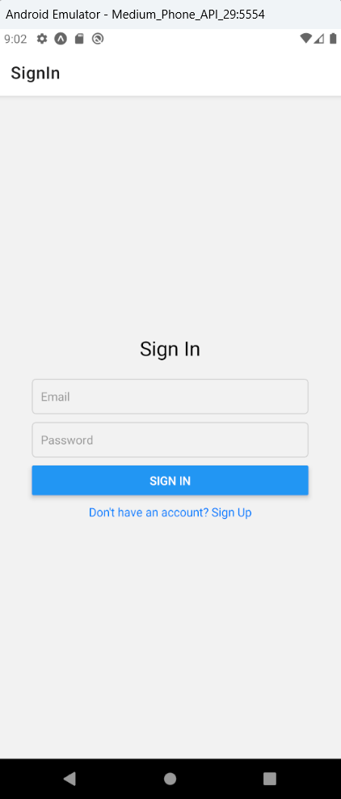
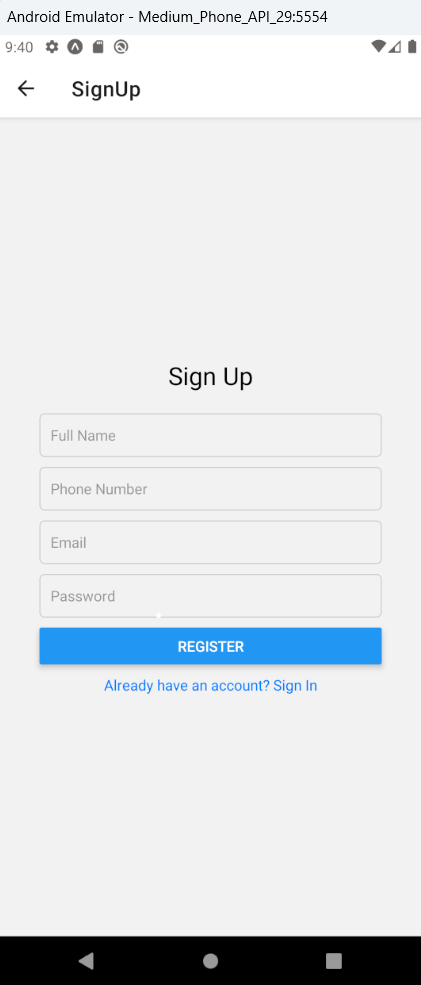
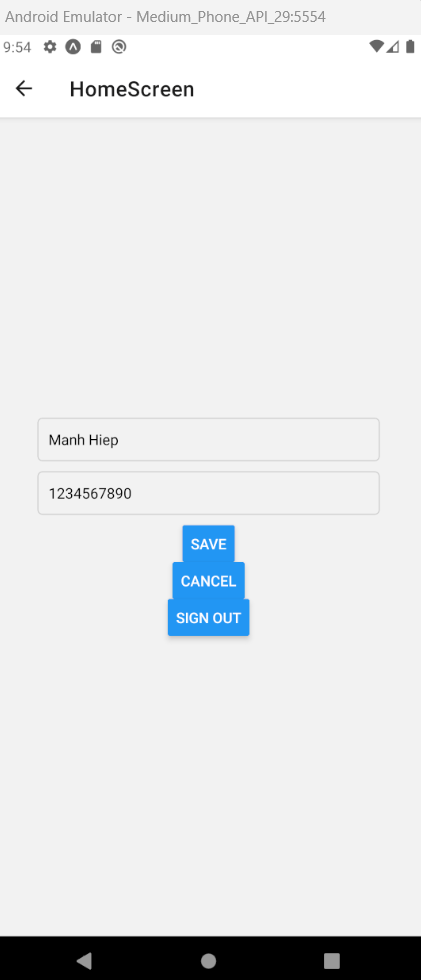
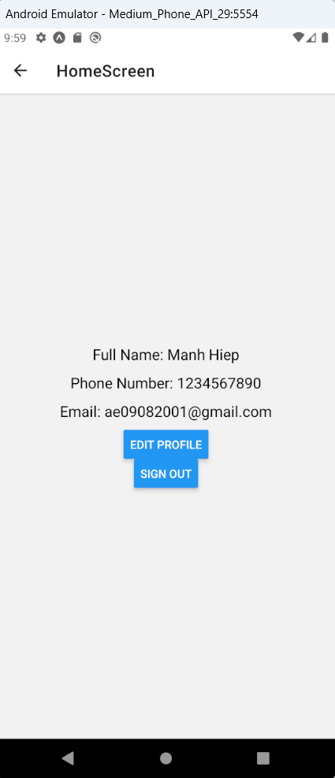

## Authors

- [@Ngo Tran Manh Hiep](https://github.com/JayceNgo)

## Set up project

    1. Create new folder
    - expo init FirebaseAuth
    - cd FirebaseAuth

    2. Install React Navigation packages:
    - npm install @react-navigation/native
    - npx expo install react-native-screens react-native-safe-area-context
    - npm install @react-navigation/native-stack

    3. Install Firebase packages:
    - expo install firebase

## Demo

    

